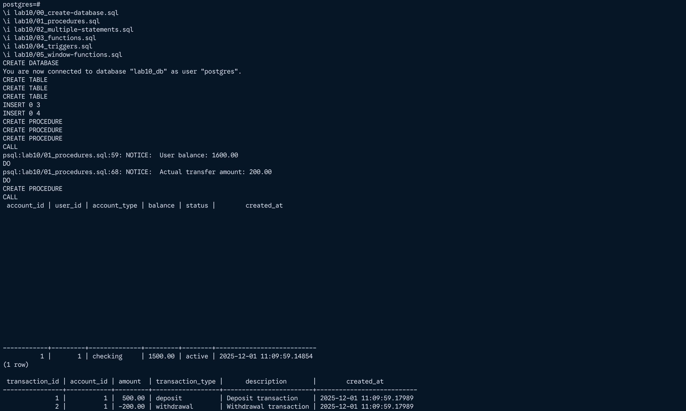
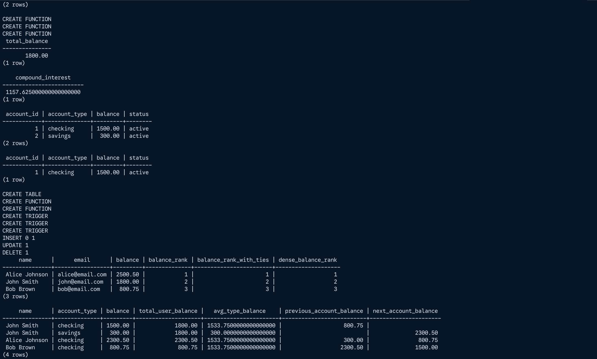

# Lab Work: Advanced SQL Features

## Purpose

- Create procedure with in, out, inout parameters; 
- Create procedure with multiple sql statements; 
- Create functions with one parameter and multiple parameters;  
- Create triggers; 
- Create window functions; 

## Files

```
.   lab10
│   ├── 00_create-database.sql
│   ├── 01_procedures.sql
│   ├── 02_multiple-statements.sql
│   ├── 03_functions.sql
│   ├── 04_triggers.sql
│   ├── 05_window-functions.sql
│   └── lab10.md
```

## Usage

Execute the files in numerical order:

```bash

\i lab10/00_create-database.sql
\i lab10/01_procedures.sql
\i lab10/02_multiple-statements.sql
\i lab10/03_functions.sql
\i lab10/04_triggers.sql
\i lab10/05_window-functions.sql
```

## Screenshots



