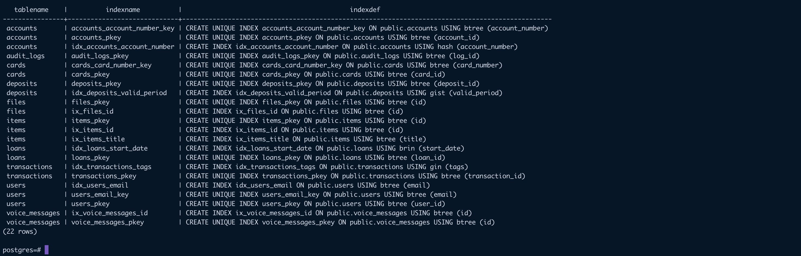

# Lab 7 - Database Indexes

### The items covered in this lab
1. Create B-tree index and write select statement for index attribute
2. Create GIN index and write select statement for index attribute (if your database haven't column with type for GIN index, add column)
3. Create Hash index and write select statement for index attribute
4. Create BRIN index and write select statement for index attribute
5. Create GiST index and write select statement for index attribute (if your database haven't column with type for GiST index, add column)
6. Show all indexes of a database

### In next executable files:
```zsh
\i lab7/01_btree-index.sql
\i lab7/02_gin-index.sql
\i lab7/03_hash-index.sql
\i lab7/04_brin-index.sql
\i lab7/05_gist-index.sql
\i lab7/06_show-indexes.sql
```

### Screenshots:

