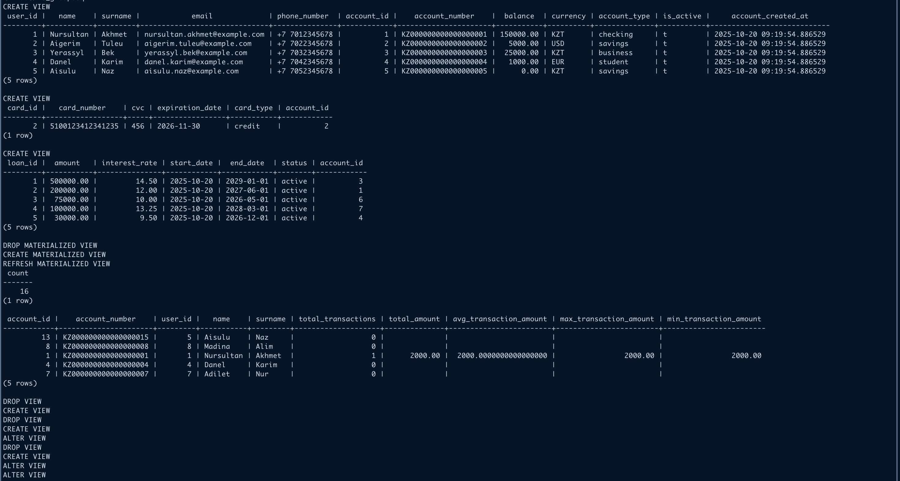
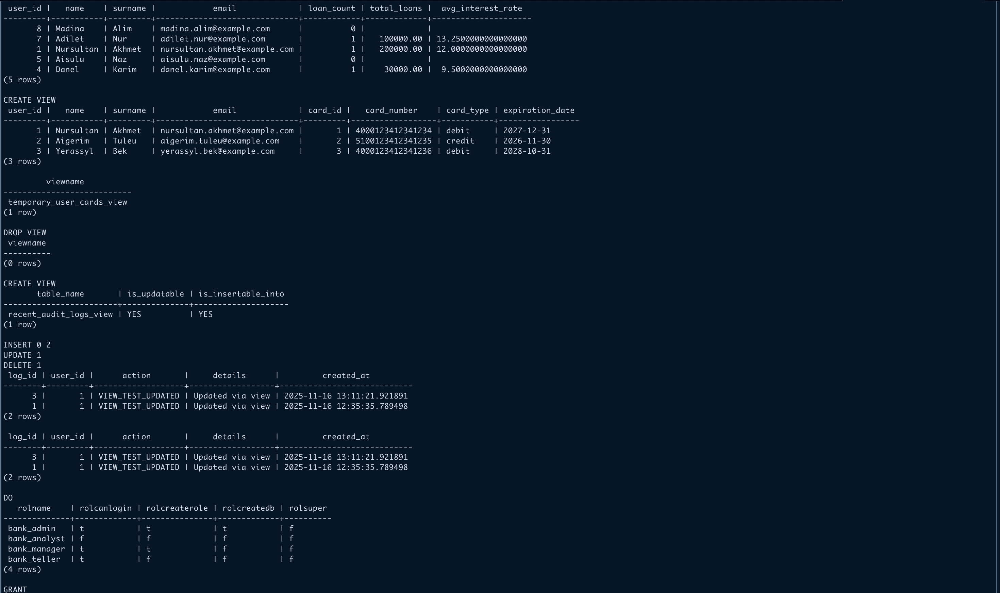
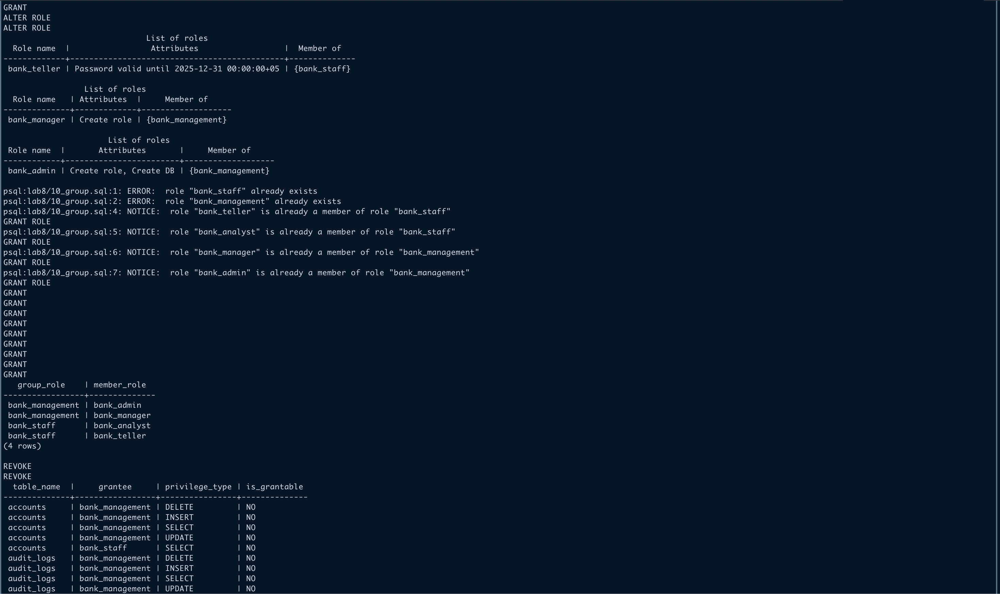
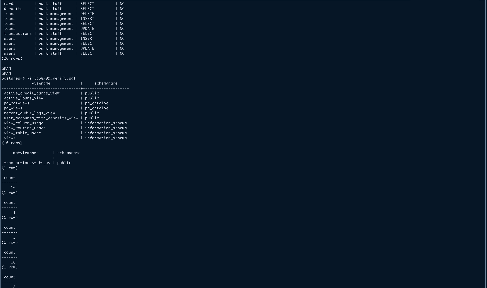
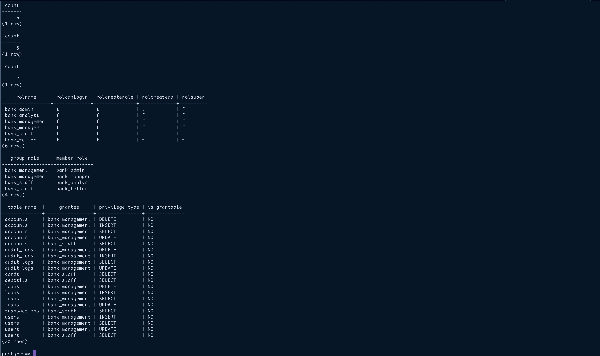

# Lab 8

## Description

- Create any simple view for your database
- Create view with local check option
- Create view with cascaded check option
- Create materialized view with no data and do all steps for loading data into the view;
- Change the defining query of a view
- Change the definition of a view;
- Remove an existing simple view;
- Create updatable view and check it
- Create a simple role, then create roles with login and create role privilege
- Create a group role and use grant and revoke commands.

## Lab structure

- `00_create_database.sql` - Creates the database and sample data
- `01_simple_view.sql` - Creates a simple view combining users and accounts
- `02_local_check.sql` - Creates view with LOCAL CHECK option using cards and accounts
- `03_cascaded_check.sql` - Creates view with CASCADED CHECK option using loans and accounts
- `04_materialized.sql` - Creates materialized view with no data and loads it
- `05_change_query.sql` - Changes the defining query of a view
- `06_change_def.sql` - Changes the definition of a view
- `07_remove.sql` - Removes an existing simple view
- `08_updatable.sql` - Creates and tests an updatable view
- `09_roles.sql` - Creates simple roles and roles with privileges
- `10_group.sql` - Creates group roles and demonstrates GRANT/REVOKE
- `99_verify.sql` - Verification script to check all created objects

## How to run

```bash
# Create database
psql -U postgres -f lab8/00_create_database.sql

psql -U postgres -d banking_db

# Run the SQL files
\i lab8/01_simple_view.sql
\i lab8/02_local_check.sql
\i lab8/03_cascaded_check.sql
\i lab8/04_materialized.sql
\i lab8/05_change_query.sql
\i lab8/06_change_def.sql
\i lab8/07_remove.sql
\i lab8/08_updatable.sql
\i lab8/09_roles.sql
\i lab8/10_group.sql

# Verify all objects were created successfully
\i lab8/99_verify.sql
```

## Screenshots




