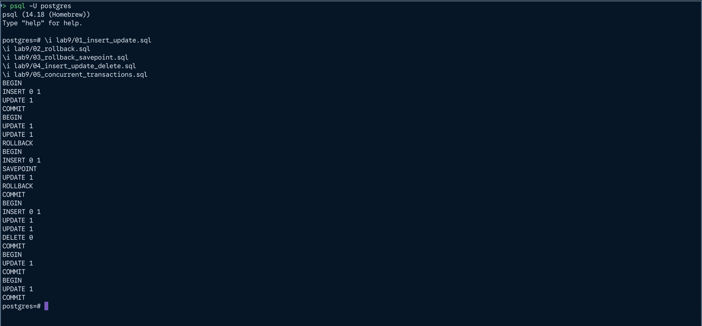

# Lab 9

## Description

- Create transaction with insert and update commands
- Create transaction with rollback
- Create transaction with rollback to savepoint
- Create transaction with insert, update and delete commands
- Create concurrent transactions with different commands

## Lab structure

```
.
├── 01_insert_update.sql
├── 02_rollback.sql
├── 03_rollback_savepoint.sql
├── 04_insert_update_delete.sql
├── 05_concurrent_transactions.sql
└── lab9.md

1 directory, 6 files
```

## How to run

```bash
# Connect to database
psql -U postgres -d banking_db

# Run the SQL files
\i lab9/01_insert_update.sql
\i lab9/02_rollback.sql
\i lab9/03_rollback_savepoint.sql
\i lab9/04_insert_update_delete.sql
\i lab9/05_concurrent_transactions.sql
```

## Screenshots

